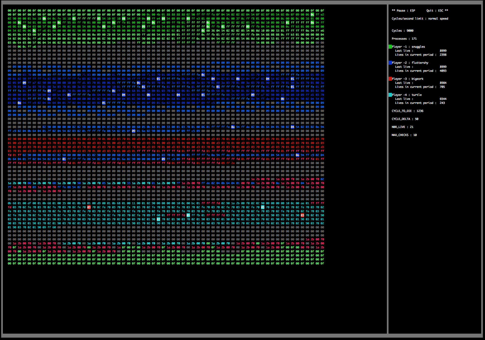

##  Name
corewar

##	ASM and VM for Corewar game

# VM

Usage: ./corewar [-dump N -n N -s N -v2 -v4 -v16 -reg -visu -fast -follow N -aff N] <champion1.cor> <...>

-dump N 	: dump memory after N cycles then exits

-n N     	: set player number

-s N     	: runs N cycles, dumps memory, pauses, then repeats

-v2      	: show cycles

-v4      	: show operations

-v16     	: show PC movements (Except for jumps)

-reg     	: show registers after new operation

-visu    	: launch ncurse mode

-fast    	: go faster in ncurse mode

-follow N	: follow only process N in ncurse mode

-aff N   	: If -visu, start ncurse mod on N

	

# ASM

Usage: ./asm [-o] source.s

-o			: doesn't output .cor file but display informations on the champion

##  Operations Description

|Opcode	 |Name	 	|Args 		  												|Bin	 |Hexa		|carry	|OPcode	 |Cycles	|DIR s   |
| ------ | -------- |:---------------------------------------------------------:| ------ | -------- | ----- | ------ | -------- | ------ |
|*1*    |**live**	|T_DIR     													|00000001|	0x01	|No		|		0|10		|4		 |
|*2*	|**ld**		|T_DIR \| T_IND, T_REG										|00000010|	0x02	|Yes	|		1|5			|4		 |
|*3*	|**st**		|T_REG, T_IND \| T_REG										|00000011|	0x03	|No		|		1|5			|-		 |
|*4*	|**add**	|T_REG, T_REG, T_REG										|00000100|	0x04	|Yes	|		1|10		|-		 |
|*5*	|**sub**	|T_REG, T_REG, T_REG										|00000101|	0x05	|Yes	|		1|10		|-		 |
|*6*	|**and**	|T_REG \| T_DIR \| T_IND, T_REG \| T_IND \| T_DIR, T_REG	|00000110|	0x06	|Yes	|		1|6			|4		 |
|*7*	|**or**		|T_REG \| T_IND \| T_DIR, T_REG \| T_IND \| T_DIR, T_REG	|00000111|	0x07	|Yes	|		1|6			|4		 |
|*8*	|**xor**	|T_REG \| T_IND \| T_DIR, T_REG \| T_IND \| T_DIR, T_REG	|00001000|	0x08	|Yes	|		1|6			|4		 |
|*9*	|**zjmp**	|T_DIR														|00001001|	0x09	|No		|		0|20		|2		 |
|*10*	|**ldi**	|T_REG \| T_DIR \| T_IND, T_DIR \| T_REG, T_REG				|00001010|	0x0A	|No		|		1|25		|2		 |
|*11*	|**sti**	|T_REG, T_REG \| T_DIR \| T_IND, T_DIR \| T_REG				|00001011|	0x0B	|No		|		1|25		|2		 |
|*12*	|**fork**	|T_DIR														|00001100|	0x0C	|No		|		0|800		|2		 |
|*13*	|**lld**	|T_DIR \| T_IND, T_REG										|00001101|	0x0D	|Yes	|		1|10		|4		 |
|*14*	|**lldi**	|T_REG \| T_DIR \| T_IND, T_DIR \| T_REG, T_REG				|00001110|	0x0E	|Yes	|		1|50		|2		 |
|*15*	|**lfork**	|T_DIR														|00001111|	0x0F	|No		|		0|1000		|2		 |
|*16*	|**aff**	|T_REG														|00010000|	0x10	|No		|		1|2			|-		 |
